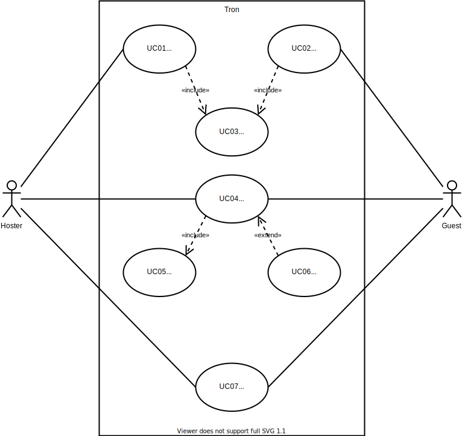
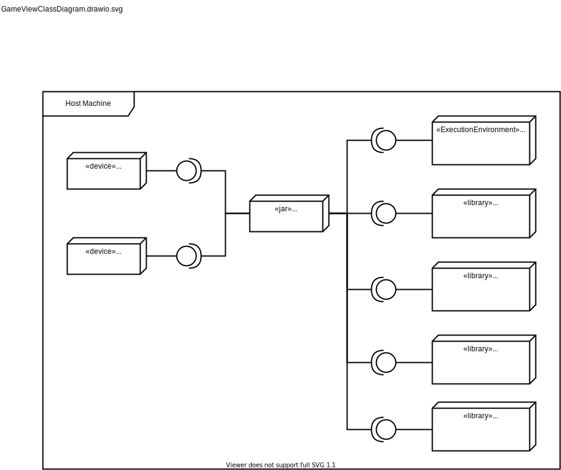
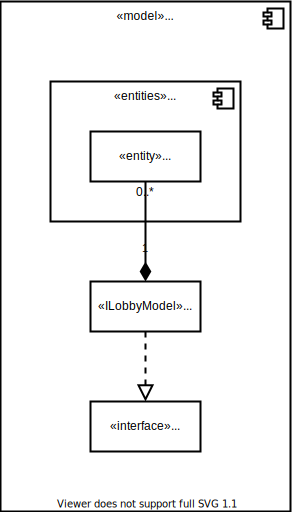

# Introduction and Goals

Distributed Tron Game

## Requirements Overview

Players of this game can create a room (host) or join one (guest). After joining a room the game will start. Each player controls the game with a keyboard to move his tron.

a Tron is a representation of the player and will continuously move forward. It can be moved right and left but not backward.

When the Tron moves it leaves a trail behind it. The objective is to force the opponent tron into walls or trails, while simultaneously avoiding them.

If the player restarted or existed the game. The opponent wins and vise versa.

| ID | Use-Case | Description |
|----|----------|-------------|
| UC01 | create game | as a host I want to create a room to host a game |
| UC02 | join game | as a guest I want to see available rooms to join one and play against the host |
| UC03 | start game | as a host I want the game to start when to guest enters |
| UC04 | play game | as a player I want to see real time updates to play the game |
| UC05 | keyboard controls | as a player I want to control the game with a keyboard |
| UC06 | restart game | as a player I want to restart a game by creating or joining one |
| UC07 | exit game | <ul><li>as a player I want to exit the game anytime i want</li><li>as a player i want to be notified when my opponent exited the game</li></ul>  |

## Quality Goals

| ID |Goal | Description |
|----|-----|-------------|
| QG01 | Server stability | server should not be blocked by the players |
| QG02 | Fairness | response time should not favour one player over the other |

## Stakeholders

| Role | Expectations |
|------|--------------|
| Customer | <ul><li>game demo with n instances and complete documentation</li><li>fixed method for project management (proof)</li><li>fixed method for documentation (important: systematic and faithful to the method)</li><li>Protocol definition with error semantics</li><li>clear representation of the structure in at least 2 hierarchy levels: component diagram, class diagram, deployment diagram</li><li>clear representation of the behavior through sequence diagram, activity diagram, state diagram</li><li>problem-solving strategies must be derived from reference literature or accepted third-party literature</li><li>code must match the documentation and documentation must match the code</li><li>Implementation in an object-oriented language</li><li>RPC interface - Own RPC implementation no framework => solution part A</li><li>ReST (at least level 1 in the Richardson Maturity Model) => solution part B</li><li>musst use Dependency-inversion-principle</li><li>The use of frameworks must be approved by the customer</li><li>a maximum of 2 players per game</li><li>each player can start a new game or enter a playroom</li></ul> |
| Developer | <ul><li>Understanding distributed systems in a practical way</li><li>getting PVL</li></ul> |

## Architecture Constraints

### Technical Constraints

| ID | Constraint | Description |
|----|------------|-------------|
| TC01 | Programing language | Implementation in an object-oriented language |
| TC02| Communication | <ul><li>RPC interface - Own RPC implementation no framework => solution part A</li><li>ReST (at least level 1 in the Richardson Maturity Model) => solution part B</li></ul> |
| TC03 | Implementation | musst use Dependency-inversion-principle |
| TC04 | Frameworks | The use of frameworks must be approved by the customer |
| TC05 | 2 players | a maximum of 2 players per game |
| TC06 | Multiple games | N Games should be supported by the system |
| TC07 | Multiplayer | each player can start a new game or enter a playroom |
| TC08 | User interface | Each player gets his owen GUI |
| TC09 | Motion | <ul><li>player moves in a straight line automatically</li><li>player can manipulate direction, but can't go back</li></ul>
| TC10 | Keyboard control | player can use the keyboard to control the game |
| TC11 | Resources usage | musst not use more than 80% of the machine resources |

was ist genau mit 80% gemeint? und soll man das im Code realisieren? (z.b. bei java kann man das an die JVM als parameter übergeben)

### Organisational constraints

| ID | Constraint | Description |
|----|------------|-------------|
| OC01 | Documentation | clear representation of the structure in at least 2 hierarchy levels: component diagram, class diagram, deployment diagram (ARC42)
| OC02 | Project Management | fixed method for project management (proof) |
| OC03 | Problem Solving | problem-solving strategies must be derived from reference literature or accepted third-party literature |
| OC04 | Deadline | project musst be delivered by 25.01.2022|

## System Scope and Context

### Business Context

<!--  -->

Technical Context
-----------------

## Solution Strategy

TODO: add use cases ids
TODO: Error cases
TODO: Need updating

| Actor | Function | Semantics | Precondition | Postcondition |
|-------|----------|-----------|--------------|---------------|
| Controller | public void showStartMenu() | forward the call to the view component with the needed handlers to show the start menu | | the view component has the needed handlers to generate the needed UI components |
| view | public void showStartMenu(EventHandler<ActionEvent> startBtnHandler) | generates the UI component for the start menu | the needed handlers were received | based on user choice the corresponding handler is called |
| Controller | private void startGame(GameMode gameMode) | setup the game environment with the appropriate handlers to start the game | player has chosen a game mode from the start menu | player can play the chosen game |
| Model | public void createGame(GameMode gameMode) | creates a game environment based on the chosen game mode | a game mode is chosen | a new game environment is created and can be used to start a game |
| Model | private void updateGame() | updates the game state based on player input | game is running in an infinite loop | player inputs are reflected in the game |
| view | public void showGameUpdate(GameUpdate gameUpdate) | present the received game update | game is running in an infinite loop | player inputs are presented in the UI |
| Model | public boolean isAllowed(Direction currentDirection) | checks if player bike direction input is allowed based on current direction | player moved his bike | movement may be applied or ignored |
| Model | public Coordinate calculateNewPosition(Coordinate currentCoordinate) | calculates the new bike coordinates based on the direction and current coordinates  | the new moving direction is allowed | new coordinates can be used to update bike trail |
| Model | private void checkForCollision(Player player) | checks periodically for collisions to eliminate losers | game loop is running | loser is eliminated from the game |
| Model | private void endGame() | stops the game loop to display the winner | only one player or no players are left | winner is displayed and a new game can be started |

## Building Block View

### Whitebox Overall System

the MVC pattern is used in the system to be developed. The reason for choosing this pattern is to make a clear division between domain objects and their presentation seen in the GUI.

X referees to the component name in the different packages 

| stereotype | Component | Interface | Description |
|------------|-----------|-----------|-------------|
| model | X | IXModel | handles the data and state including the logic |
| view | X | IXView | handles the representation and generate the needed UI components |
| controller | X | IXController | enables the interconnection between the view and model so it acts as an intermediary. |

#### Level 2

##### Model

###### Game

###### Lobby

how to sync rooms between models if we have multiple Models instances?
(Remote room factory should be also singleton?)

##### View

###### Game

TODO

###### Lobby

TODO

#### Controller

###### Game

TODO

###### Lobby

TODO

## Runtime View 

### UC01: Create Game

wie macht man es async?  
ist das ein oder zwei Sequenzdiagramme?  
ist die Kommunikation zwischen Game und Lobby Controller richtig?  
macht man alle Räume remote?  

### UC02: Join Game

### UC03: Start Game

wie moduliert man das?

wenn einem Raum beigetreten wird sollten die UpdateChanel instanzen getaucht werden -> Local-instance/remote-stub

### UC04: Play Game

wie zeigt man dass das in der Game-Controller-Komponente läuft? oder State machine?  
soll man hier update controlling machen? (wenn z.b. nicht der gesuchte Update geschickt wurde)

Darf der LobbyController das Spiel starten?  
Wenn nein  
wie kann man unterscheiden zwischen dem ersten update und dem Rest ohne bei jedem Update zu prüfen?

TODO: view update state doesn't depend on model update state both run asynchronously (model pushes the update)  
TODO: factory pattern  
TODO: Protocol is Interface and processing instructions  
TODO: ideally one diagram one arrow  
TODO: state machine pattern better than dispatcher pattern  
TODO: state pattern for rooms  

[comment]: <> (\<Runtime Scenario 1\> {#__runtime_scenario_1})

[comment]: <> (----------------------)

[comment]: <> (-   *\<insert runtime diagram or textual description of the scenario\>*)

[comment]: <> (-   *\<insert description of the notable aspects of the interactions)

[comment]: <> (    between the building block instances depicted in this diagram.\>*)

[comment]: <> (\<Runtime Scenario 2\> {#__runtime_scenario_2})

[comment]: <> (----------------------)

[comment]: <> (... {#_})

[comment]: <> (---)

[comment]: <> (\<Runtime Scenario n\> {#__runtime_scenario_n})

[comment]: <> (----------------------)

## Deployment View

[comment]: <> (Infrastructure Level 1 {#_infrastructure_level_1})

[comment]: <> (----------------------)

[comment]: <> (***\<Overview Diagram\>***)

[comment]: <> (Motivation)

[comment]: <> (:   *\<explanation in text form\>*)

[comment]: <> (Quality and/or Performance Features)

[comment]: <> (:   *\<explanation in text form\>*)

[comment]: <> (Mapping of Building Blocks to Infrastructure)

[comment]: <> (:   *\<description of the mapping\>*)

[comment]: <> (Infrastructure Level 2 {#_infrastructure_level_2})

[comment]: <> (----------------------)

[comment]: <> (### *\<Infrastructure Element 1\>* {#__emphasis_infrastructure_element_1_emphasis})

[comment]: <> (*\<diagram + explanation\>*)

[comment]: <> (### *\<Infrastructure Element 2\>* {#__emphasis_infrastructure_element_2_emphasis})

[comment]: <> (*\<diagram + explanation\>*)

[comment]: <> (...)

[comment]: <> (### *\<Infrastructure Element n\>* {#__emphasis_infrastructure_element_n_emphasis})

[comment]: <> (*\<diagram + explanation\>*)

[comment]: <> (Cross-cutting Concepts {#section-concepts})

[comment]: <> (======================)

[comment]: <> (*\<Concept 1\>* {#__emphasis_concept_1_emphasis})

[comment]: <> (---------------)

[comment]: <> (*\<explanation\>*)

[comment]: <> (*\<Concept 2\>* {#__emphasis_concept_2_emphasis})

[comment]: <> (---------------)

[comment]: <> (*\<explanation\>*)

[comment]: <> (...)

[comment]: <> (*\<Concept n\>* {#__emphasis_concept_n_emphasis})

[comment]: <> (---------------)

[comment]: <> (*\<explanation\>*)

## Design Decisions

### Scaling techniques

#### Hiding communication latencies

"reduce the overall communication, for example, by moving part of the computation that is normally done at the server to the client process requesting the service" Page 21

-> everything is created locally and we only exchange user input

#### Partitioning and distribution

dosn't really fit our usecase? (peer to peer connection no encapsulated services)

#### Replication

peer to peer not much can be done (maybe directory server can benefits)

#### Replication

a transit system doesn't benefit from this

[comment]: <> (Quality Requirements {#section-quality-scenarios})

[comment]: <> (====================)

[comment]: <> (Quality Tree {#_quality_tree})

[comment]: <> (------------)

[comment]: <> (Quality Scenarios {#_quality_scenarios})

[comment]: <> (-----------------)

[comment]: <> (Risks and Technical Debts {#section-technical-risks})

[comment]: <> (=========================)

[comment]: <> (Glossary {#section-glossary})

[comment]: <> (========)

[comment]: <> (+-----------------------+-----------------------------------------------+)

[comment]: <> (| Term                  | Definition                                    |)

[comment]: <> (+=======================+===============================================+)

[comment]: <> (| *\<Term-1\>*          | *\<definition-1\>*                            |)

[comment]: <> (+-----------------------+-----------------------------------------------+)

[comment]: <> (| *\<Term-2\>*          | *\<definition-2\>*                            |)

[comment]: <> (+-----------------------+-----------------------------------------------+)
