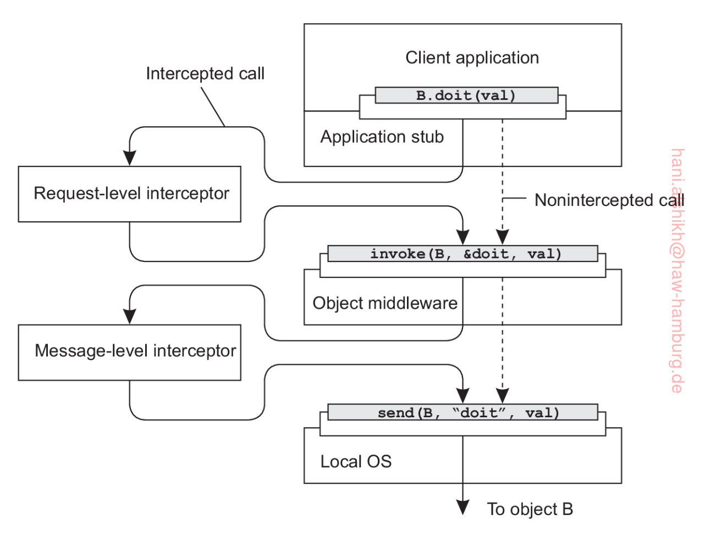
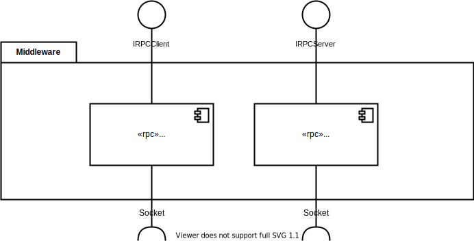
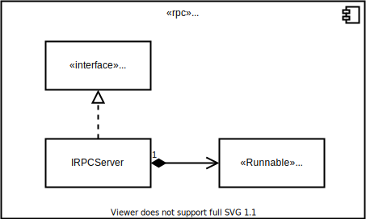
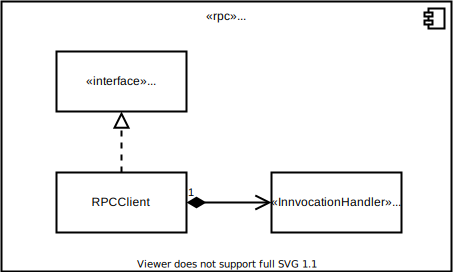

# Introduction and Goals

Middleware for Distributed Systems

## Requirements Overview

Provide services beyond those provided by the operating system to enable the various components of a distributed system (in this case distributed tron game) to communicate and manage data.

## Quality Goals

| Goal | Description |
|-------------|-------------|
| Scalability | TODO Tanenbaum |
| Openness | TODO Tanenbaum |
| Sharing resources | TODO Tanenbaum |
| Transparency | TODO Tanenbaum |

## Stakeholders

| Role | Expectations |
|------|--------------|
| Frontend Developer | TODO Tanenbaum |
| Backend Developer | TODO Tanenbaum |
| Network admin | TODO Tanenbaum |
| Developer | TODO Tanenbaum |

## Architecture Constraints

### Technical Constraints

| Constraint | Description |
|------------|-------------|
| TODO | TODO |

### Organisational constraints

| Constraint | Description |
|------------|-------------|
| TODO | TODO |

## System Scope and Context

### Business Context

Technical Context
-----------------

TODO

## Solution Strategy

| Actor | Function | Semantics | Precondition | Postcondition |
|-------|----------|-----------|--------------|---------------|
| RPCServer | public void register(Class<?> serviceInterface, Class<?> impl) | register a service that can be used by the client | | the service is registered and the client can call it's methods |
| RPCServer | public void start() throws IOException | start the server to receive client calls | a port is defined and the service is registered | client can call the service methods |
| RPCServer | private Runnable send(Socket client) | sends the client call to the service stub for invocation | server is running and acceptation calls | the client call is invoked and the result is returned |
| ServerStub | public void run() | unmarshal the client call and invoke it | the service is registered | the client received the invocation result |
| RPCClient | static <T> T getServiceStub(final Class<?> serviceInterface, final InetSocketAddress serverAddress) | dynamically creates a stub for the provided service interface | | the client can invoke methods on the server |
| ClientStub | public Object invoke(Object proxy, Method method, Object[] args) throws Throwable | invokes the method of the stub object | client can connect to server | the method is invoked and the result is received |

## Building Block View

### Whitebox Overall System

| Component | Description |
|------------|--------------|
| TODO | TODO |

TODO: Interfaces (functional description)

### Level 2

### Server Component (Black Box)

#### Responsibility

TODO

#### Interfaces

| Methode | Kurzbeschreibung |
|---------|------------------|
| TODO | TODO |

### Client Component (Black Box)

#### Responsibility

TODO

#### Interfaces

| Methode | Kurzbeschreibung |
|---------|------------------|
| TODO | TODO |

[comment]: <> (### White Box *\<building block 1\>* {#_white_box_emphasis_building_block_1_emphasis})

[comment]: <> (*\<white box template\>*)

[comment]: <> (### White Box *\<building block 2\>* {#_white_box_emphasis_building_block_2_emphasis})

[comment]: <> (*\<white box template\>*)

[comment]: <> (...)

[comment]: <> (### White Box *\<building block m\>* {#_white_box_emphasis_building_block_m_emphasis})

[comment]: <> (*\<white box template\>*)

[comment]: <> (Level 3 {#_level_3})

[comment]: <> (-------)

[comment]: <> (### White Box \<\_building block x.1\_\> {#_white_box_building_block_x_1})

[comment]: <> (*\<white box template\>*)

[comment]: <> (### White Box \<\_building block x.2\_\> {#_white_box_building_block_x_2})

[comment]: <> (*\<white box template\>*)

[comment]: <> (### White Box \<\_building block y.1\_\> {#_white_box_building_block_y_1})

[comment]: <> (*\<white box template\>*)

[comment]: <> (## Runtime View {#section-runtime-view})

[comment]: <> (\<Runtime Scenario 1\> {#__runtime_scenario_1})

[comment]: <> (----------------------)

[comment]: <> (-   *\<insert runtime diagram or textual description of the scenario\>*)

[comment]: <> (-   *\<insert description of the notable aspects of the interactions)

[comment]: <> (    between the building block instances depicted in this diagram.\>*)

[comment]: <> (\<Runtime Scenario 2\> {#__runtime_scenario_2})

[comment]: <> (----------------------)

[comment]: <> (... {#_})

[comment]: <> (---)

[comment]: <> (\<Runtime Scenario n\> {#__runtime_scenario_n})

[comment]: <> (----------------------)

[comment]: <> (Deployment View {#section-deployment-view})

[comment]: <> (===============)

[comment]: <> (![DeploymentDiagram]&#40;docs/diagrams/DeploymentDiagram.svg&#41;)

[comment]: <> ([comment]: <> &#40;Infrastructure Level 1 {#_infrastructure_level_1}&#41;)

[comment]: <> ([comment]: <> &#40;----------------------&#41;)

[comment]: <> ([comment]: <> &#40;***\<Overview Diagram\>***&#41;)

[comment]: <> ([comment]: <> &#40;Motivation&#41;)

[comment]: <> ([comment]: <> &#40;:   *\<explanation in text form\>*&#41;)

[comment]: <> ([comment]: <> &#40;Quality and/or Performance Features&#41;)

[comment]: <> ([comment]: <> &#40;:   *\<explanation in text form\>*&#41;)

[comment]: <> ([comment]: <> &#40;Mapping of Building Blocks to Infrastructure&#41;)

[comment]: <> ([comment]: <> &#40;:   *\<description of the mapping\>*&#41;)

[comment]: <> ([comment]: <> &#40;Infrastructure Level 2 {#_infrastructure_level_2}&#41;)

[comment]: <> ([comment]: <> &#40;----------------------&#41;)

[comment]: <> ([comment]: <> &#40;### *\<Infrastructure Element 1\>* {#__emphasis_infrastructure_element_1_emphasis}&#41;)

[comment]: <> ([comment]: <> &#40;*\<diagram + explanation\>*&#41;)

[comment]: <> ([comment]: <> &#40;### *\<Infrastructure Element 2\>* {#__emphasis_infrastructure_element_2_emphasis}&#41;)

[comment]: <> ([comment]: <> &#40;*\<diagram + explanation\>*&#41;)

[comment]: <> ([comment]: <> &#40;...&#41;)

[comment]: <> ([comment]: <> &#40;### *\<Infrastructure Element n\>* {#__emphasis_infrastructure_element_n_emphasis}&#41;)

[comment]: <> ([comment]: <> &#40;*\<diagram + explanation\>*&#41;)

[comment]: <> (Cross-cutting Concepts {#section-concepts})

[comment]: <> (======================)

[comment]: <> (*\<Concept 1\>* {#__emphasis_concept_1_emphasis})

[comment]: <> (---------------)

[comment]: <> (*\<explanation\>*)

[comment]: <> (*\<Concept 2\>* {#__emphasis_concept_2_emphasis})

[comment]: <> (---------------)

[comment]: <> (*\<explanation\>*)

[comment]: <> (...)

[comment]: <> (*\<Concept n\>* {#__emphasis_concept_n_emphasis})

[comment]: <> (---------------)

[comment]: <> (*\<explanation\>*)

[comment]: <> (Design Decisions {#section-design-decisions})

[comment]: <> (================)

[comment]: <> (Quality Requirements {#section-quality-scenarios})

[comment]: <> (====================)

[comment]: <> (Quality Tree {#_quality_tree})

[comment]: <> (------------)

[comment]: <> (Quality Scenarios {#_quality_scenarios})

[comment]: <> (-----------------)

[comment]: <> (Risks and Technical Debts {#section-technical-risks})

[comment]: <> (=========================)

[comment]: <> (Glossary {#section-glossary})

[comment]: <> (========)

[comment]: <> (+-----------------------+-----------------------------------------------+)

[comment]: <> (| Term                  | Definition                                    |)

[comment]: <> (+=======================+===============================================+)

[comment]: <> (| *\<Term-1\>*          | *\<definition-1\>*                            |)

[comment]: <> (+-----------------------+-----------------------------------------------+)

[comment]: <> (| *\<Term-2\>*          | *\<definition-2\>*                            |)

[comment]: <> (+-----------------------+-----------------------------------------------+)
