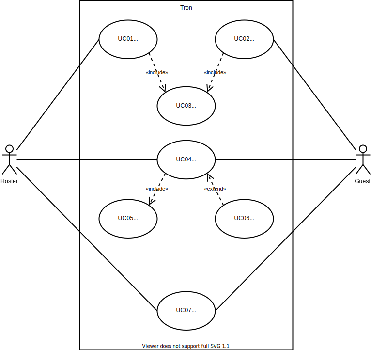
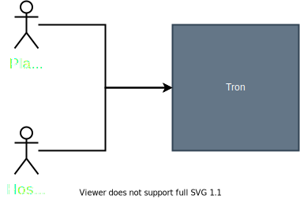
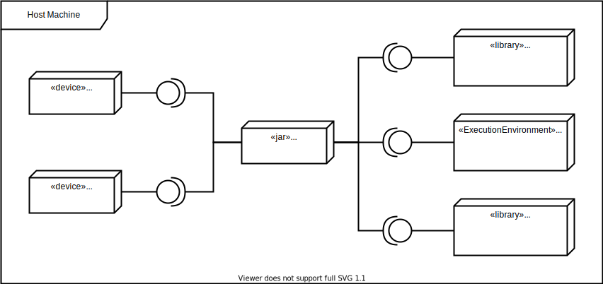
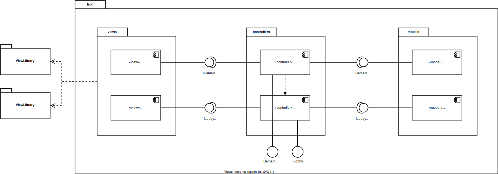

# Introduction and Goals

Distributed Tron Game

## Requirements Overview

Players of this game can host a lobby or join one. After joining a lobby the game will start. Each player control the game with a keyboard to move his tron.

a Tron is a representation of the player and will continuously move forward. It can be moved right and left but not backward.

When the Tron moves it leaves a trail behind it. The objective is to force the enemy tron into walls or trails, while simultaneously avoiding them.

If the player restarted or existed the game. The enemy wins.

## Quality Goals

| Goal | Description |
|-------------|-------------|
| Server stability | server should not be blocked by the players |
| Fairness | response time should not favour one player over the other |

## Stakeholders

| Role | Expectations |
|------|--------------|
| Customer | <ul><li>game demo with n instances and complete documentation</li><li>fixed method for project management (proof)</li><li>fixed method for documentation (important: systematic and faithful to the method)</li><li>Protocol definition with error semantics</li><li>clear representation of the structure in at least 2 hierarchy levels: component diagram, class diagram, deployment diagram</li><li>clear representation of the behavior through sequence diagram, activity diagram, state diagram</li><li>problem-solving strategies must be derived from reference literature or accepted third-party literature</li><li>code must match the documentation and documentation must match the code</li><li>Implementation in an object-oriented language</li><li>RPC interface - Own RPC implementation no framework => solution part A</li><li>ReST (at least level 1 in the Richardson Maturity Model) => solution part B</li><li>musst use Dependency-inversion-principle</li><li>The use of frameworks must be approved by the customer</li><li>a maximum of 2 players per game</li><li>each player can start a new game or enter a playroom</li></ul> |
| Developer | <ul><li>Understanding distributed systems in a practical way</li><li>getting PVL</li></ul> |

## Architecture Constraints

### Technical Constraints

| Constraint | Description |
|------------|-------------|
| Programing language | Implementation in an object-oriented language |
| Communication | <ul><li>RPC interface - Own RPC implementation no framework => solution part A</li><li>ReST (at least level 1 in the Richardson Maturity Model) => solution part B</li></ul> |
| Implementation | musst use Dependency-inversion-principle |
| Frameworks | The use of frameworks must be approved by the customer |
| 2 players | a maximum of 2 players per game |
| Multiple games | N Games should be supported by the system |
| Multiplayer | each player can start a new game or enter a playroom |
| User interface | Each player gets his owen GUI |
| Motion | <ul><li>player moves in a straight line automatically</li><li>player can manipulate direction, but can't go back</li></ul>
| Keyboard control | player can use the keyboard to control the game |

### Organisational constraints

| Constraint | Description |
|------------|-------------|
| Documentation | clear representation of the structure in at least 2 hierarchy levels: component diagram, class diagram, deployment diagram (ARC42)
| Project Management | fixed method for project management (proof) |
| Problem Solving | problem-solving strategies must be derived from reference literature or accepted third-party literature |
| Deadline | project musst be delivered by 03.02.2021|

## System Scope and Context

### Business Context

<!--  -->

TODO: use cases table with ids

Technical Context
-----------------

## Solution Strategy

TODO: add use cases ids
TODO: Error cases

| Actor | Function | Semantics | Precondition | Postcondition |
|-------|----------|-----------|--------------|---------------|
| Controller | public void showStartMenu() | forward the call to the view component with the needed handlers to show the start menu | | the view component has the needed handlers to generate the needed UI components |
| view | public void showStartMenu(EventHandler<ActionEvent> startBtnHandler) | generates the UI component for the start menu | the needed handlers were received | based on user choice the corresponding handler is called |
| Controller | private void startGame(GameMode gameMode) | setup the game environment with the appropriate handlers to start the game | player has chosen a game mode from the start menu | player can play the chosen game |
| Model | public void createGame(GameMode gameMode) | creates a game environment based on the chosen game mode | a game mode is chosen | a new game environment is created and can be used to start a game |
| Model | private void updateGame() | updates the game state based on player input | game is running in an infinite loop | player inputs are reflected in the game |
| view | public void showGameUpdate(GameUpdate gameUpdate) | present the received game update | game is running in an infinite loop | player inputs are presented in the UI |
| Model | public boolean isAllowed(Direction currentDirection) | checks if player bike direction input is allowed based on current direction | player moved his bike | movement may be applied or ignored |
| Model | public Coordinate calculateNewPosition(Coordinate currentCoordinate) | calculates the new bike coordinates based on the direction and current coordinates  | the new moving direction is allowed | new coordinates can be used to update bike trail |
| Model | private void checkForCollision(Player player) | checks periodically for collisions to eliminate losers | game loop is running | loser is eliminated from the game |
| Model | private void endGame() | stops the game loop to display the winner | only one player or no players are left | winner is displayed and a new game can be started |

## Building Block View

### Whitebox Overall System

| Component | Description |
|------------|--------------|
| GameController | enables the interconnection between the GameViewer and GameModeler so it acts as an intermediary. |
| GameModeler | handels game data and state including the game logic |
| GameViewer | handels game representation and generate the needed UI components |
| ViewLibrary | provides methods to draw on a canvas and to register, show and hide overlays such as menus |

TODO: Interfaces (functional description)

[comment]: <> (Level 2 {#_level_2})

[comment]: <> (-------)

[comment]: <> (### White Box *\<building block 1\>* {#_white_box_emphasis_building_block_1_emphasis})

[comment]: <> (*\<white box template\>*)

[comment]: <> (### White Box *\<building block 2\>* {#_white_box_emphasis_building_block_2_emphasis})

[comment]: <> (*\<white box template\>*)

[comment]: <> (...)

[comment]: <> (### White Box *\<building block m\>* {#_white_box_emphasis_building_block_m_emphasis})

[comment]: <> (*\<white box template\>*)

[comment]: <> (Level 3 {#_level_3})

[comment]: <> (-------)

[comment]: <> (### White Box \<\_building block x.1\_\> {#_white_box_building_block_x_1})

[comment]: <> (*\<white box template\>*)

[comment]: <> (### White Box \<\_building block x.2\_\> {#_white_box_building_block_x_2})

[comment]: <> (*\<white box template\>*)

[comment]: <> (### White Box \<\_building block y.1\_\> {#_white_box_building_block_y_1})

[comment]: <> (*\<white box template\>*)

## Runtime View {#section-runtime-view}

TODO: view update state doesn't depend on model update state both run asynchronously (model pushes the update)
TODO: stubs in the application components
TODO: factory pattern
TODO: central tick manager or keep sending and take the last result
TODO: use what possible of the network resources as nothing is free
TODO: Protocol is Interface and processing instructions
TODO: thread to manage messages which is observable und to call the corresponding component
TODO: we don't want to save anything if the information (update) is not there we forget about it (transient and not persistent (no message queues)) so TCP
TODO: ideally one diagram one arrow
TODO: state machine pattern better than dispatcher pattern
TODO: state pattern for rooms
TODO: LobbyManager singleton is not a good idea
TODO: LobbyManager registers a service by the middle ware

\<Runtime Scenario 1\> {#__runtime_scenario_1}
----------------------

-   *\<insert runtime diagram or textual description of the scenario\>*

-   *\<insert description of the notable aspects of the interactions
    between the building block instances depicted in this diagram.\>*

\<Runtime Scenario 2\> {#__runtime_scenario_2}
----------------------

... {#_}
---

\<Runtime Scenario n\> {#__runtime_scenario_n}
----------------------

Deployment View {#section-deployment-view}
===============

[comment]: <> (Infrastructure Level 1 {#_infrastructure_level_1})

[comment]: <> (----------------------)

[comment]: <> (***\<Overview Diagram\>***)

[comment]: <> (Motivation)

[comment]: <> (:   *\<explanation in text form\>*)

[comment]: <> (Quality and/or Performance Features)

[comment]: <> (:   *\<explanation in text form\>*)

[comment]: <> (Mapping of Building Blocks to Infrastructure)

[comment]: <> (:   *\<description of the mapping\>*)

[comment]: <> (Infrastructure Level 2 {#_infrastructure_level_2})

[comment]: <> (----------------------)

[comment]: <> (### *\<Infrastructure Element 1\>* {#__emphasis_infrastructure_element_1_emphasis})

[comment]: <> (*\<diagram + explanation\>*)

[comment]: <> (### *\<Infrastructure Element 2\>* {#__emphasis_infrastructure_element_2_emphasis})

[comment]: <> (*\<diagram + explanation\>*)

[comment]: <> (...)

[comment]: <> (### *\<Infrastructure Element n\>* {#__emphasis_infrastructure_element_n_emphasis})

[comment]: <> (*\<diagram + explanation\>*)

Cross-cutting Concepts {#section-concepts}
======================

*\<Concept 1\>* {#__emphasis_concept_1_emphasis}
---------------

*\<explanation\>*

*\<Concept 2\>* {#__emphasis_concept_2_emphasis}
---------------

*\<explanation\>*

...

*\<Concept n\>* {#__emphasis_concept_n_emphasis}
---------------

*\<explanation\>*

Design Decisions {#section-design-decisions}
================

Quality Requirements {#section-quality-scenarios}
====================

Quality Tree {#_quality_tree}
------------

Quality Scenarios {#_quality_scenarios}
-----------------

Risks and Technical Debts {#section-technical-risks}
=========================

Glossary {#section-glossary}
========

+-----------------------+-----------------------------------------------+
| Term                  | Definition                                    |
+=======================+===============================================+
| *\<Term-1\>*          | *\<definition-1\>*                            |
+-----------------------+-----------------------------------------------+
| *\<Term-2\>*          | *\<definition-2\>*                            |
+-----------------------+-----------------------------------------------+
