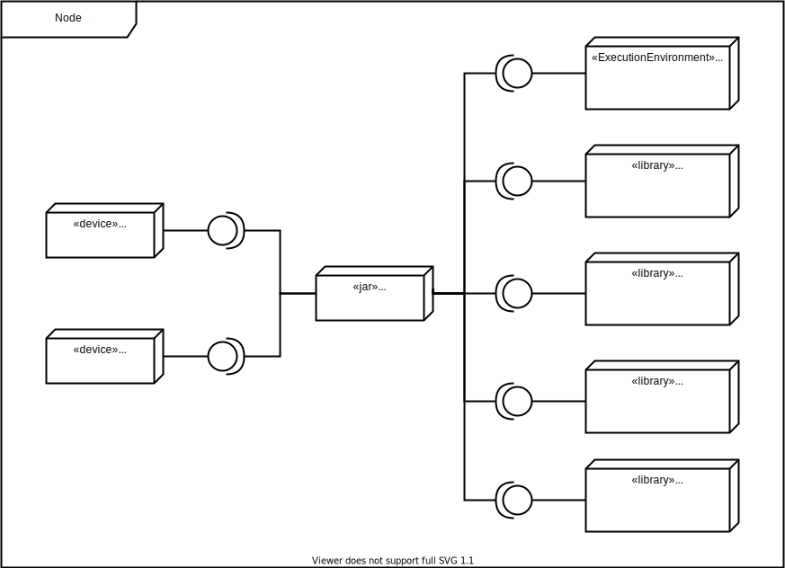
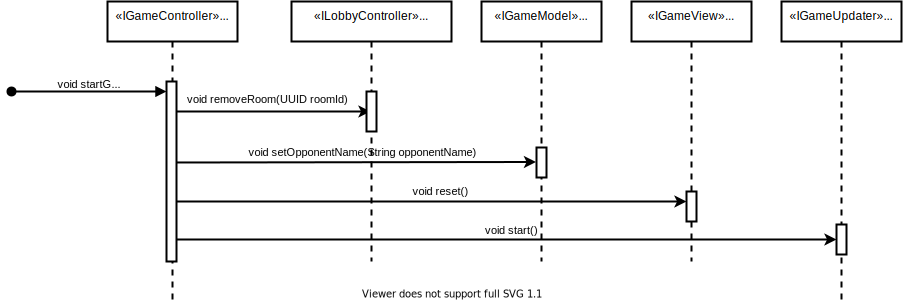
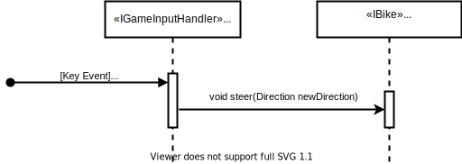

# Introduction and Goals

Develop a Distributed Tron Game where people can play the together while being on different machines.  

The Game is a clone of the "Light Cycles Mode" in the original [Tron Video Game](https://en.wikipedia.org/wiki/Tron_(video_game)) from 1982.

## Requirements Overview

Players of this game can create a room (host) or join one (guest). After joining a room the game will start. Each player controls the game with a keyboard to move his tron.  

A Tron is a representation of the player and will continuously move forward. It can be moved left and right but not backward.  
When the Tron moves it leaves a trail behind it. The objective is to force the opponent tron into walls or trails, while simultaneously avoiding them.  

If the player restarted or existed the game. The opponent wins and vise versa.

| ID | Use-Case | Description |
|----|----------|-------------|
| UC01 | create game | as a host I want to create a room to host a game |
| UC02 | join game | as a guest I want to see available rooms to join one and play against the host |
| UC03 | start game | as a host I want the game to start when to guest enters |
| UC04 | play game | as a player I want to see real time updates to play the game |
| UC05 | keyboard controls | as a player I want to control the game with a keyboard |
| UC06 | restart game | as a player I want to restart a game by creating or joining one |
| UC07 | exit game | <ul><li>as a player I want to exit the game anytime i want</li><li>as a player i want to be notified when my opponent exited the game</li></ul>  |

## Quality Goals

| ID | Goal | Description |
|----|------|-------------|
| QG01 | Server stability | server should not be blocked by the players |
| QG02 | Fairness | response time should not favour one player over the other |

## Stakeholders

| Role | Expectations |
|------|--------------|
| Customer | <ul><li>game demo with n instances and complete documentation</li><li>fixed method for project management (proof)</li><li>fixed method for documentation (important: systematic and faithful to the method)</li><li>Protocol definition with error semantics</li><li>clear representation of the structure in at least 2 hierarchy levels: component diagram, class diagram, deployment diagram</li><li>clear representation of the behavior through sequence diagram, activity diagram, state diagram</li><li>problem-solving strategies must be derived from reference literature or accepted third-party literature</li><li>code must match the documentation and documentation must match the code</li><li>Implementation in an object-oriented language</li><li>RPC interface - Own RPC implementation no framework </li><li>musst use Dependency-inversion-principle</li><li>The use of frameworks must be approved by the customer</li><li>a maximum of 2 players per game</li><li>each player can start a new game or enter a playroom</li></ul> |
| Developer | <ul><li>Understanding distributed systems in a practical way</li><li>getting PVL</li></ul> |

## Architecture Constraints

### Technical Constraints

| ID | Constraint | Description |
|----|------------|-------------|
| TC01 | Programing language | Implementation in an object-oriented language |
| TC02 | Communication | RPC interface - Own RPC implementation no framework |
| TC03 | Implementation | musst use Dependency-inversion-principle |
| TC04 | Frameworks | The use of frameworks must be approved by the customer |
| TC05 | 2 players | a maximum of 2 players per game |
| TC06 | Multiple games | N Games should be supported by the system |
| TC07 | Multiplayer | each player can start a new game or enter a playroom |
| TC08 | User interface | Each player gets his owen GUI |
| TC09 | Motion | <ul><li>player moves in a straight line automatically</li><li>player can manipulate direction, but can't go back</li></ul>
| TC10 | Keyboard control | player can use the keyboard to control the game |
| TC11 | Resources usage | musst not use more than 80% of the machine resources |

### Organisational constraints

| ID | Constraint | Description |
|----|------------|-------------|
| OC01 | Documentation | clear representation of the structure in at least 2 hierarchy levels: component diagram, class diagram, deployment diagram (ARC42)
| OC02 | Project Management | fixed method for project management (proof) |
| OC03 | Problem Solving | problem-solving strategies must be derived from reference literature or accepted third-party literature |
| OC04 | Deadline | project musst be delivered by 27.01.2022 23:59 UTC|

## System Scope and Context

### Business Context

Technical Context
-----------------

## g

| Actor | Function | UCID | Semantics | Precondition | Postcondition |
|-------|-------|----------|-----------|--------------|---------------|
| Game Controller | void showStartMenu(String message) | UC01 | forward the call to the view component with the needed handlers to show the start menu | game has started | the view component has the needed handlers to generate the needed UI components and the player can change his name choose to create or join a game |
| Game Controller | <ul><li>void createGame()</li><li>void joinGame()</li></ul> | <ul><li>UC01</li><li>UC02</li></ul> | setup the game environment with the appropriate handlers to start the game | player clicked create/join game | player has to wait for someone to join or choose a room to join |
| Lobby Controller | void createRoom(IPlayerUpdateChannel updateChannel) | UC01 | create a room from the player update channel that was provided by the game controller | player clicked create game | a room was created with the corresponding update channel that can be exchanged with the joiner (guest). The room is also registered by the lobby model and listed for others to join |
| Game Controller | void startGame(String opponentName) | UC03 | removes the room, resets the view and start the game updater | the guest double clicked a room to join | game updater is listening for updates and player can play the game |
| Game Controller | void updateGame() | UC04 | updates the game state based on player input while insuring fairness against the opponent and insuring both have the same opportunity to react to updates | game is running in an infinite loop | player inputs are reflected in the game |
| Game View | void showGame(IGame game) | UC04 | present the current state of the game | game is running in an infinite loop | player inputs are presented in the UI |
| Game Model | void steer(Direction newDirection) | UC05 | checks if player bike direction input is allowed based on current direction and steer it | player pressed one of the defined keyboard keys to move his bike | movement may be applied or ignored |
| Game Controller | void endGame(String message) | UC06 | ends the current game and calls void showStartMenu(String message) | player won/lost the current game | player can start a new game or join one |
| Game Controller | boolean fairPlayInsured() | UC07 | on each tick check if the received update version match with the current player update and if not or no update was received call void endGame(String message) to end the game | the game loop is runniing |

## Building Block View

### Whitebox Overall System

#### App

the MVC pattern is used in the system to be developed. The reason for choosing this pattern is to make a clear division between domain objects and their presentation seen in the GUI.

X referees to the component name in the model/view/controller packages (for example X Model corresponde to Game Mdel)

| Component | Description |
|-----------|-------------|
| X Modle | The central component of the MVC pattern. directly manages the data, logic and rules of the application. |
| X View | represent the information received from the model through the controller |
| X Controller | Accepts input and converts it to commands for the model or view |
| Stub | the fusing layer between the middleware and the application |

 Component | Interface | Description |
|------------|-----------|-----------|-------------|
| Model | X | IXModel | handles the data and state including the logic |
| View | X | IXView | handles the representation and generate the needed UI components |
| Controller | X | IXController | enables the interconnection between the view and model so it acts as an intermediary. |

#### Manager

TODO

#### Middleware

see [Middleware](docs/middleware/README.md)

#### Level 2

##### Model

###### Game

###### Lobby

##### View

###### Game

###### Lobby

#### Controller

###### Game

###### Lobby

## Runtime View

### UC01: Create Game

### UC02: Join Game

#### Join Room

#### Room is Full

### UC03: Start Game

### UC04: Play Game

#### Player Update Observed

### UC05: keyboard controls

### UC06: Restart Game

### UC07: Exit Game

## Deployment View

## Cross-cutting Concepts

### Technical Decisions

#### TD01: limiting the number of Threads

TC11 requires the system to not exceed 80% of resource usage. This is easily achievable by parametrizing the JVM.

However and to ensure fairness between the different instances of the game java ExecutorService is used throughout the system. this insures a limiting factor on the number of threads created.

the number of threads per instance can be callculated as follows:

GameUpdater -> number of available processors
RpcServerStub -> number of available processors + 1 for the server thread

in case of 8 processors each instance has a limit of 17 controlled threads

#### TD02: allowing for a small update cache

the GameUpdater observes multiple invalidated states coming from different threads this means, while highly unlikely but in case of for example two blocked threads that delivers the current and next PlayerUpdate ConcurrentHashMap is used to store the received updates and make them available for the next game updating iteration.

OUV: the version of the observed PlayerUpdate with the same version as the currently processed PlayerUpdate

the cache can never grow outside two elements as per design current update version + 1 is only created when an update with the same version is observed (OUV) and therefore the maximum case of updates observered occures when the game updater observes a OUV + 1 when still awaiting the OUV  

### TD03: game state lock

in case updating the state took longer than the tick waiting period the next update call is blocked

### TD04: ensure fair play

to ensure fair play as described in QG02 it is ensured that both players are observing the same state (matching PlayerUpdate versions).

It is however possible that the opponent disconnects by for example closing the game therefore a "Fairness limit" is set by waiting UPDATE_MAX_RETRIES / FRAMES_PER_SECOND seconds before endinig the game in favour of the player

### TD05: UI lock

the UILock is needed to 

1. ensure that the player had the chance to observe the new state and act accordingly (even if it's not really possible but at least he can estimate)

2. ensure that the game state doesn't change while the GUI is still updating

### TD06: direction locking

this allows the player to spam the input keys without really effecting the end result. 

This also helps the player to make a "last minute decision" when for example pressing the wrong key (weather it's possible or not depends on multiple factories one of them is how fast the player fingers are :))

### TD07: game instance <-> player id

a game and all it's component are coupled (when needed) to one player per instance and therefore one random id is generated on the start of the instance (new GameModel -> new Player -> random player id)

### TD08: triggering start game event

implementing the state pattern for a Room to for example kick off the start game event onFull() was considered and founded to be overkill as the a game can only handle two players TC05 and the Room is carbeged after the UpdateChannels were exchanged (by closing the room). this exchange will trigger the game to start.

other consideration were:

1. passing the game starter handler to the room it self
    - The GameController has no reference of the room and therefore can't pass the correct handler reference to start the game

2. triggering a start game event when an update is received
    - the requires the game updater to start when it's not really necessary and will result in a conditional check on each update that only needed for the first one.
    
### TD09: Config

it is recognized that this is not the best way/practise to do it but in this case it should be more than enough.

### TD10: Config

in the standalone version the model is shared as a the source of truth for rooms, while in the distributed one the directory server is the source of truth

## Design Decisions

### Scaling techniques

#### Hiding communication latencies

"reduce the overall communication, for example, by moving part of the computation that is normally done at the server to the client process requesting the service" Page 21

-> everything is created locally and we only exchange user input

#### Partitioning and distribution

dosn't really fit our usecase? (peer to peer connection no encapsulated services)

#### Replication

peer to peer not much can be done (maybe directory server can benefits)

#### Replication

a transit system doesn't benefit from this

#### Architecture

"An important goal of distributed systems is to separate applications from underlying platforms by providing a middleware layer." page 55

to reduce the load on the "server" node , that could be any node who starts the directory server -> peer to peer

bottlenecks, single source of fehler, _____ -> decentralized Hierarchically organized peer-to-peer networks architecture (the directory server is centralized and per node (process) only one rpc server for all games -> is it then a hybrid?)

everything is local except for the opponent state (update) -> Page 78 Figure 2.16 (e)

implementing each service by means of a separate server may be a waste of resources. it is often more efficient to have a single superserver Page 129 -> one rpc server per process

## Glossary

| Term | Definition |