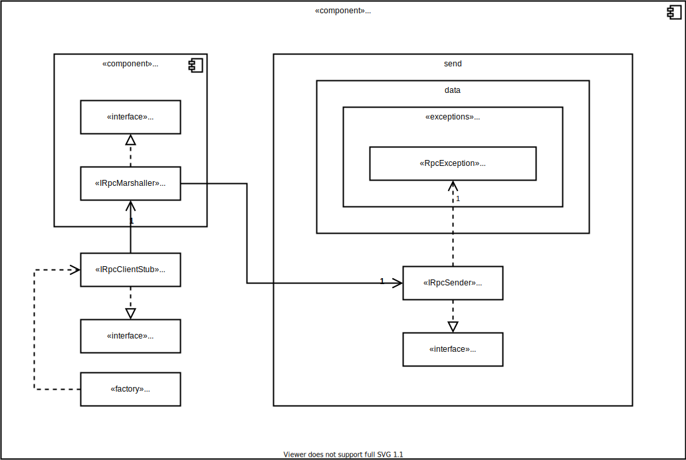
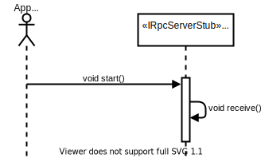
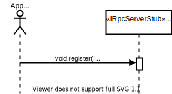
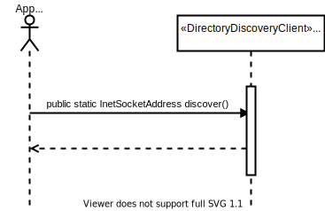

# Introduction and Goals

A distributed system is a collection of autonomous computing elements that appears to its users as a single coherent system.

middleware is the same to a distributed system as what an operating system is to a computer is.

the important goals that should be met to make building a distributed system worth the effort are:

A distributed system:

- should make resources easily accessible. 
- should hide the fact that resources are distributed across a network.
- should be open
- should be scalable.

## Requirements Overview

the middleware assist the development of distributed applications and it is considered as a manager of resources offering its ap- plications to efficiently share and deploy those resources across a network. Next to resource management, it offers services that can also be found in most operating systems. The main difference, is that middleware services are offered in a networked environment.

Due to the time constraint fault tolerance is not a requirement

| ID | Use-Case | Description |
|----|----------|-------------|
| UC01 | offer services | as an application I want to specify and offer my services |
| UC02 | lookup services | as an application I want to lookup and use the offered services |
| UC03 | invoke a function | as an application i want invoke a function that is implemented and executed on a remote computer as if it was locally available. |

## Quality Goals

| ID | Goal | Description |
|----|------|-------------|
| QG01 | Access | Hide differences in data representation and how an object is accessed |
| QG02 | Location | Hide where an object is located |
| QG03 | Relocation | Hide that an object may be moved to another location while in use |
| QG04 | Migration | Hide that an object may move to another location |
| QG05 | Replication | Hide that an object is replicated |
| QG06 | Concurrency | Hide that an object may be shared by several independent users |
| QG07 | Failure | Hide the failure and recovery of an object |

## Stakeholders

| Role | Expectations |
|------|--------------|
| application | adhear to the design principles and avoid common pitfails like:   <ul><li>The network is reliable</li><li>The network is secure</li><li>The network is homogeneous</li><li>The topology does not change</li><li>Latency is zero</li><li>Bandwidth is infinite</li><li>Transport cost is zero</li><li>There is one administrator</li></ul> |

## Architecture Constraints

### Technical Constraints

TODO

### Organisational constraints

TODO

## System Scope and Context

### Business Context

TODO: Update me

### Technical Context

TODO

## Solution Strategy

TODO

## Building Block View

### Overall System White Box

| Component | Description |
|-----------|-------------|

#### RPC Black Box

| Interface | Description |
|-----------|-------------|

#### Directory Server Black Box

| Interface | Description |
|-----------|-------------|

#### Discovery Server Black Box

| Interface | Description |
|-----------|-------------|

### Level 2

#### RPC White Box

| Component | Description |
|-----------|-------------|

##### Application Stub Black Box

| Interface | Description |
|-----------|-------------|

##### Client Stub Black Box

| Interface | Description |
|-----------|-------------|

##### Message Black Box

| Interface | Description |
|-----------|-------------|

##### Callback Black Box

| Interface | Description |
|-----------|-------------|

##### Server Stub Black Box

| Interface | Description |
|-----------|-------------|

#### Directory Server White Box

#### Discovery Service White Box

### Level 3

#### RPC White Box

##### Application Stub White Box

##### Client Stub White Box

##### Message White Box

##### Callback White Box

##### Server Stub White Box

## Runtime View

fault tolerance is not a requirement and therefore all sequences describe the best case scenario

### Level 1

#### UC01: Offer Services

##### Starting the rpc server

##### Registering a service

##### Announce a service

###### Discover Directory Server

###### Register a service to be announced

#### UC02: lookup Services

##### Subscribe to service group

#### UC03: invoke a function

### Level 2

#### UC01: Offer Services

##### Receiving calls

#### UC03: invoke a function

##### Sending calls

TODO: when documenting the protocol write how every object is serialized

[comment]: <> (\<Runtime Scenario 1\> {#__runtime_scenario_1})

[comment]: <> (----------------------)

[comment]: <> (-   *\<insert runtime diagram or textual description of the scenario\>*)

[comment]: <> (-   *\<insert description of the notable aspects of the interactions)

[comment]: <> (    between the building block instances depicted in this diagram.\>*)

[comment]: <> (\<Runtime Scenario 2\> {#__runtime_scenario_2})

[comment]: <> (----------------------)

[comment]: <> (... {#_})

[comment]: <> (---)

[comment]: <> (\<Runtime Scenario n\> {#__runtime_scenario_n})

[comment]: <> (----------------------)

[comment]: <> (## Deployment View)

[comment]: <> (Infrastructure Level 1 {#_infrastructure_level_1})

[comment]: <> (----------------------)

[comment]: <> (***\<Overview Diagram\>***)

[comment]: <> (Motivation)

[comment]: <> (:   *\<explanation in text form\>*)

[comment]: <> (Quality and/or Performance Features)

[comment]: <> (:   *\<explanation in text form\>*)

[comment]: <> (Mapping of Building Blocks to Infrastructure)

[comment]: <> (:   *\<description of the mapping\>*)

[comment]: <> (Infrastructure Level 2 {#_infrastructure_level_2})

[comment]: <> (----------------------)

[comment]: <> (### *\<Infrastructure Element 1\>* {#__emphasis_infrastructure_element_1_emphasis})

[comment]: <> (*\<diagram + explanation\>*)

[comment]: <> (### *\<Infrastructure Element 2\>* {#__emphasis_infrastructure_element_2_emphasis})

[comment]: <> (*\<diagram + explanation\>*)

[comment]: <> (...)

[comment]: <> (### *\<Infrastructure Element n\>* {#__emphasis_infrastructure_element_n_emphasis})

[comment]: <> (*\<diagram + explanation\>*)

[comment]: <> (Cross-cutting Concepts {#section-concepts})

[comment]: <> (======================)

[comment]: <> (*\<Concept 1\>* {#__emphasis_concept_1_emphasis})

[comment]: <> (---------------)

[comment]: <> (*\<explanation\>*)

[comment]: <> (*\<Concept 2\>* {#__emphasis_concept_2_emphasis})

[comment]: <> (---------------)

[comment]: <> (*\<explanation\>*)

[comment]: <> (...)

[comment]: <> (*\<Concept n\>* {#__emphasis_concept_n_emphasis})

[comment]: <> (---------------)

[comment]: <> (*\<explanation\>*)

## Design Decisions

#### Architecture

centralized component is often used to handle initial requests, for example to redirect a client to a replica server, which, in turn, may be part of a peer-to-peer network as is the case in BitTorrent-based systems. Page 102 -> Directory server

Concurrent sever page 129 -> RpcServer

we don't really care about structured naming or "human-readable" names. We mainly distribute rooms which are grouped under the same service id therefore we decided to implement a very simplified directory service (the expensive lookup/search and/or the complex mapping of attributes are not a problem in our usecase).

TODO: lamport is implemented in a indirect way (PlayerUpdate version)

[comment]: <> (Quality Requirements {#section-quality-scenarios})

[comment]: <> (====================)

[comment]: <> (Quality Tree {#_quality_tree})

[comment]: <> (------------)

[comment]: <> (Quality Scenarios {#_quality_scenarios})

[comment]: <> (-----------------)

[comment]: <> (Risks and Technical Debts {#section-technical-risks})

[comment]: <> (=========================)

[comment]: <> (Glossary {#section-glossary})

[comment]: <> (========)

[comment]: <> (+-----------------------+-----------------------------------------------+)

[comment]: <> (| Term                  | Definition                                    |)

[comment]: <> (+=======================+===============================================+)

[comment]: <> (| *\<Term-1\>*          | *\<definition-1\>*                            |)

[comment]: <> (+-----------------------+-----------------------------------------------+)

[comment]: <> (| *\<Term-2\>*          | *\<definition-2\>*                            |)

[comment]: <> (+-----------------------+-----------------------------------------------+)
