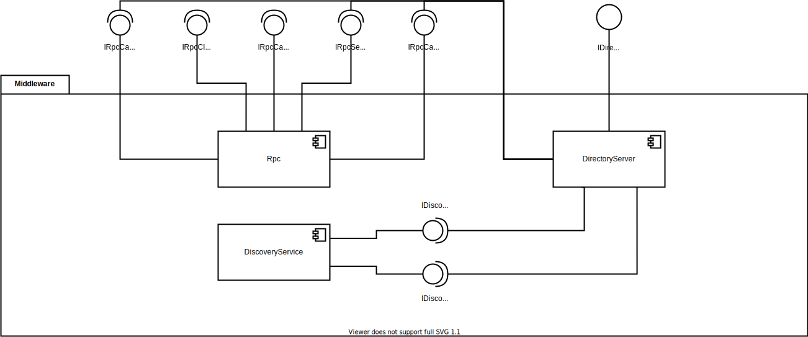
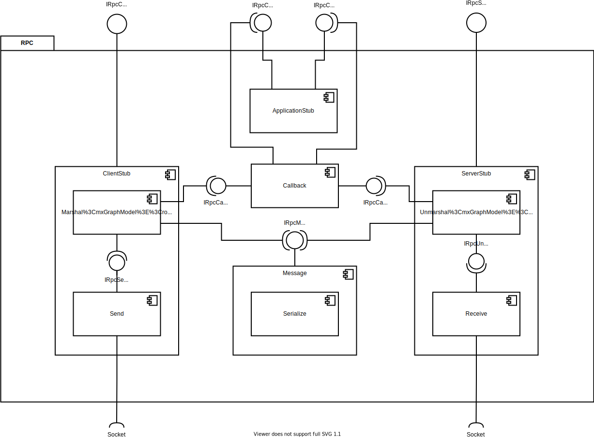

# Introduction and Goals

TODO

A distributed system is a collection of autonomous computing elements that appears to its users as a single coherent system.

middleware is the same to a distributed system as what an operating system is to a computer:

our important goals that should be met to make building a distributed system worth the effort. A distributed system should make resources easily accessible; it should hide the fact that resources are distributed across a network; it should be open; and it should be scalable.

## Requirements Overview

TODO

Being open

Transparency Description
Access
Location Relocation
Migration Replication Concurrency
Failure
Hide differences in data representation and how an object is accessed
Hide where an object is located
Hide that an object may be moved to another location while in use
Hide that an object may move to another location Hide that an object is replicated
Hide that an object may be shared by several independent users
Hide the failure and recovery of an object

## Quality Goals

TODO

## Stakeholders

TODO

## Architecture Constraints

### Technical Constraints

TODO

### Organisational constraints

TODO

## System Scope and Context

### Business Context

TODO: application is the customer
TODO

Technical Context
-----------------

TODO

## Solution Strategy

TODO

## Building Block View

### Overall System White Box

| Component | Description |
|-----------|-------------|

#### RPC Black Box

| Interface | Description |
|-----------|-------------|

#### Directory Server Black Box

| Interface | Description |
|-----------|-------------|

#### Discovery Server Black Box

| Interface | Description |
|-----------|-------------|

### Level 2

#### RPC White Box

| Component | Description |
|-----------|-------------|

##### Application Stub Black Box

| Interface | Description |
|-----------|-------------|

##### Client Stub Black Box

| Interface | Description |
|-----------|-------------|

##### Message Black Box

| Interface | Description |
|-----------|-------------|

##### Callback Black Box

| Interface | Description |
|-----------|-------------|

##### Server Stub Black Box

| Interface | Description |
|-----------|-------------|

### Level 3

##### Application Stub White Box

##### Client Stub White Box

##### Message White Box

##### Callback White Box

##### Server Stub White Box

##### DirectoryServer

Best practise for sharing the port and multicast address

## Runtime View

TODO
TODO: when documenting the protocol write how every object is serialized

[comment]: <> (\<Runtime Scenario 1\> {#__runtime_scenario_1})

[comment]: <> (----------------------)

[comment]: <> (-   *\<insert runtime diagram or textual description of the scenario\>*)

[comment]: <> (-   *\<insert description of the notable aspects of the interactions)

[comment]: <> (    between the building block instances depicted in this diagram.\>*)

[comment]: <> (\<Runtime Scenario 2\> {#__runtime_scenario_2})

[comment]: <> (----------------------)

[comment]: <> (... {#_})

[comment]: <> (---)

[comment]: <> (\<Runtime Scenario n\> {#__runtime_scenario_n})

[comment]: <> (----------------------)

[comment]: <> (## Deployment View)

[comment]: <> (Infrastructure Level 1 {#_infrastructure_level_1})

[comment]: <> (----------------------)

[comment]: <> (***\<Overview Diagram\>***)

[comment]: <> (Motivation)

[comment]: <> (:   *\<explanation in text form\>*)

[comment]: <> (Quality and/or Performance Features)

[comment]: <> (:   *\<explanation in text form\>*)

[comment]: <> (Mapping of Building Blocks to Infrastructure)

[comment]: <> (:   *\<description of the mapping\>*)

[comment]: <> (Infrastructure Level 2 {#_infrastructure_level_2})

[comment]: <> (----------------------)

[comment]: <> (### *\<Infrastructure Element 1\>* {#__emphasis_infrastructure_element_1_emphasis})

[comment]: <> (*\<diagram + explanation\>*)

[comment]: <> (### *\<Infrastructure Element 2\>* {#__emphasis_infrastructure_element_2_emphasis})

[comment]: <> (*\<diagram + explanation\>*)

[comment]: <> (...)

[comment]: <> (### *\<Infrastructure Element n\>* {#__emphasis_infrastructure_element_n_emphasis})

[comment]: <> (*\<diagram + explanation\>*)

[comment]: <> (Cross-cutting Concepts {#section-concepts})

[comment]: <> (======================)

[comment]: <> (*\<Concept 1\>* {#__emphasis_concept_1_emphasis})

[comment]: <> (---------------)

[comment]: <> (*\<explanation\>*)

[comment]: <> (*\<Concept 2\>* {#__emphasis_concept_2_emphasis})

[comment]: <> (---------------)

[comment]: <> (*\<explanation\>*)

[comment]: <> (...)

[comment]: <> (*\<Concept n\>* {#__emphasis_concept_n_emphasis})

[comment]: <> (---------------)

[comment]: <> (*\<explanation\>*)

## Design Decisions

#### Architecture

centralized component is often used to handle initial requests, for example to redirect a client to a replica server, which, in turn, may be part of a peer-to-peer network as is the case in BitTorrent-based systems. Page 102 -> Directory server

Concurrent sever page 129 -> RpcServer

we don't really care about structured naming or "human-readable" names. We mainly distribute rooms which are grouped under the same service id therefore we decided to implement a very simplified directory service (the expensive lookup/search and/or the complex mapping of attributes are not a problem in our usecase).

TODO: lamport is implemented in a indirect way (PlayerUpdate version)

[comment]: <> (Quality Requirements {#section-quality-scenarios})

[comment]: <> (====================)

[comment]: <> (Quality Tree {#_quality_tree})

[comment]: <> (------------)

[comment]: <> (Quality Scenarios {#_quality_scenarios})

[comment]: <> (-----------------)

[comment]: <> (Risks and Technical Debts {#section-technical-risks})

[comment]: <> (=========================)

[comment]: <> (Glossary {#section-glossary})

[comment]: <> (========)

[comment]: <> (+-----------------------+-----------------------------------------------+)

[comment]: <> (| Term                  | Definition                                    |)

[comment]: <> (+=======================+===============================================+)

[comment]: <> (| *\<Term-1\>*          | *\<definition-1\>*                            |)

[comment]: <> (+-----------------------+-----------------------------------------------+)

[comment]: <> (| *\<Term-2\>*          | *\<definition-2\>*                            |)

[comment]: <> (+-----------------------+-----------------------------------------------+)
