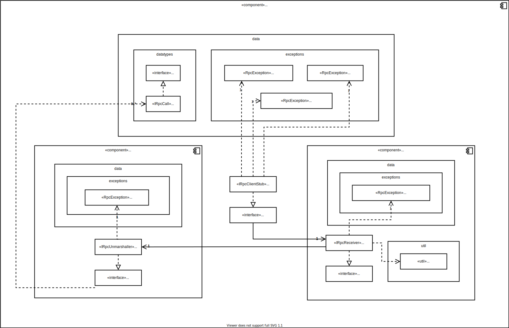
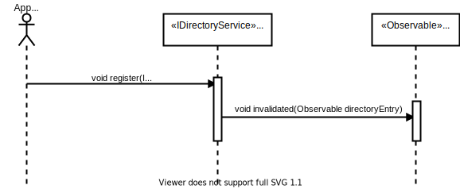

# Introduction and Goals

A distributed system is a collection of autonomous computing elements that appears to its users as a single coherent system.
The Middleware is the same to a distributed system as what an operating system is to a computer.
The important goals that should be met to make building a distributed system worth the effort are:

A distributed system:

- should make resources easily accessible.
- should hide the fact that resources are distributed across a network.
- should be open
- should be scalable.

## Requirements Overview

the middleware assist the development of distributed applications and it is considered as a manager of resources offering its ap- plications to efficiently share and deploy those resources across a network. Next to resource management, it offers services that can also be found in most operating systems. The main difference, is that middleware services are offered in a networked environment.

Due to the time constraint fault tolerance is not a requirement

| ID | Use-Case | Description |
|----|----------|-------------|
| UC01 | offer services | as an application I want to specify and offer my services |
| UC02 | lookup services | as an application I want to lookup and use the offered services |
| UC03 | invoke a function | as an application i want invoke a function that is implemented and executed on a remote computer as if it was locally available. |

## Quality Goals

| ID | Goal | Description |
|----|------|-------------|
| QG01 | Access | Hide differences in data representation and how an object is accessed |
| QG02 | Location | Hide where an object is located |
| QG03 | Relocation | Hide that an object may be moved to another location while in use |
| QG04 | Migration | Hide that an object may move to another location |
| QG05 | Replication | Hide that an object is replicated |
| QG06 | Concurrency | Hide that an object may be shared by several independent users |
| QG07 | Failure | Hide the failure and recovery of an object |

## Stakeholders

| Role | Expectations |
|------|--------------|
| Customer | <ul><li>fixed method for project management (proof)</li><li>fixed method for documentation (important: systematic and faithful to the method)</li><li>Protocol definition with error semantics</li><li>clear representation of the structure in at least 2 hierarchy levels: component diagram, class diagram, deployment diagram</li><li>clear representation of the behavior through sequence diagram, activity diagram, state diagram</li><li>problem-solving strategies must be derived from reference literature or accepted third-party literature</li><li>code must match the documentation and documentation must match the code</li><li>Implementation in an object-oriented language</li><li>musst use Dependency-inversion-principle</li><li>The use of frameworks must be approved by the customer</li></ul> |
| Application | <ul><li>should be easy to integrate</li><li>should have comprehensive Dokumentation to work with</li><li>Adhear to the design principles and avoid common pitfails like:   <ul><li>The network is reliable</li><li>The network is secure</li><li>The network is homogeneous</li><li>The topology does not change</li><li>Latency is zero</li><li>Bandwidth is infinite</li><li>Transport cost is zero</li><li>There is one administrator</li></ul></li></ul> |
| Developer | <ul><li>should be maintainable</li><li>should be expandable</li></ul> |

## Architecture Constraints

### Technical Constraints

| ID | Constraint | Description |
|----|------------|-------------|
| TC01 | Programing language | Implementation in an object-oriented language |
| TC02 | Implementation | <ul><li>musst use Dependency-inversion-principle</li><li>should be easy to integrate</li><li>should be maintainable</li><li>should be expandable</li></ul> |
| TC04 | Frameworks | The use of frameworks must be approved by the customer |

### Organisational constraints

| ID | Constraint | Description |
|----|------------|-------------|
| OC01 | Documentation | clear representation of the structure in at least 2 hierarchy levels: component diagram, class diagram, deployment diagram (ARC42)
| OC02 | Project Management | fixed method for project management (proof) |
| OC03 | Problem Solving | problem-solving strategies must be derived from reference literature or accepted third-party literature |
| OC04 | Deadline | project musst be delivered by 27.01.2022 23:59 UTC|

## System Scope and Context

### Business Context

### Technical Context

## Solution Strategy

| Actor | Function | UCID | Semantics | Precondition | Postcondition |
|-------|-------|----------|-----------|--------------|---------------|
| ServerStub | void start() | UC01 | starts the rpc server which setup a udp and tcp server on the same port and start listening for income sockets | | rpc receiver is up and listening on a random port |
| ServerStub | void receive() | UC01 | accept incoming sockets and forward the data to the rpc unmarshaller | rpc receiver was started | the server thread is blocked until socket connections are made |
| ServerStub | void register(IRpcCalleeAppStub rpcCalleeAppStub) | UC01 | register a services to be called if a rpc call was made to the same service id | rpc server stub was initialised | application can register services |
| Discover | static InetSocketAddress discover() | UC01 | start listening on the specified discovery address and port | | the directory server address was discovered and returned |
| DirectoryServer | void register(IDirectoryEntry directoryEntry) | UC01 | register a service to announce to listeners | the directory server is up and running on a node | the service is registered and will be announced to current listeners |
| DirectoryServer | void addListenerTo(UUID serviceId, InvalidationListener listener) | UC02 | offers a push approach to lookup all services under the same service id | | all new services with the same service id will be announced to service listeners |
| ClientStub | void invoke(UUID serviceId, IRpcCallbackHandler rpcCallbackHandler, boolean isBestEffort, Method method, Object... args) | UC03 | forwards the invoked function with application preferences to the rpc marshaller | application called a function on a remote service | rpc marshaller received the function call and started the unmarshalling process |
| Callback | void register(UUID requestId, IRpcCallbackHandler rpcCallbackHandler) | UC03 | registers a callback handler that will be invoked when the result of the request/invocation was received | rpc callback handler was provided which implies that the application is waiting for a callback | the handler is registered and can be used by a callback |
| Callback | void retrn(UUID requestId, Object result) | UC03 | sets the invocation result of the rpc call for the callback handler | a handler exists under the same request id otherwise the result is dropped | the callback handler is invoked with the received result |

## Building Block View

### Overall System White Box

| Component | Description |
|-----------|-------------|
| RPC | Main Component with multiple Sub-Components for Remote Procedure Calls in the Middleware |
| DirectoryServer | Component which holds all Network relevant information about other participants of the distributed System |
| DiscoveryService | Component to find new Announcements in the distributed System |

#### RPC Black Box

| Interface | Description |
|-----------|-------------|
| IRpcCallerAppStub | Interface to be implemented to offer RPC Methods to be called |
| IRpcCalleeAppStub | Interface to be implemented call RPC Methods that are offered |
| IRpcClientStub | Interface for a Client Stub to invoke a Method on a Service and hand it of to the Marshaller |
| IRpcSerializationApi | Interface to handle the serialization and deserialization of Objects |
| IRpcCallbackHandler | Interface to handle Callbacks for Methods and provide the designated Function with the result Data |
| IRpcServerStub | Interface for a Server Stub which handles a list of all Methods it can call |

#### Directory Server Black Box

| Interface | Description |
|-----------|-------------|
| IDirectoryService | Interface for a Service to keep track of all discoverd Providers from Discovery |

#### Discovery Server Black Box

| Interface | Description |
|-----------|-------------|
| IDiscoveryServer | Interface for a Server broadcasting Announcements through the Network |
| IDiscoveryClient | Interface for a Client listening for Server Announcements |

### Level 2

#### RPC White Box

| Component | Description |
|-----------|-------------|
| ApplicationStub | Component for the Application to Interface with the Middleware |
| ClientStub | All logic related to invoking a RPC Method |
| Message | Component which houses all Resources to create or read Messages that have been or will be sent |
| Callback | Handles the Callback of RPC Method Calls |
| ServerStub | All logic related to actually call the remotely invoked Method |

##### Application Stub Black Box

| Interface | Description |
|-----------|-------------|
| IRpcCallerAppStub | Interface to be implemented to offer RPC Methods to be called |
| IRpcCalleeAppStub | Interface to be implemented call RPC Methods that are offered |

##### Client Stub Black Box

| Interface | Description |
|-----------|-------------|
| IRpcSender | Interface to send the actual Data over the Network |
| IRpcClientStub | Interface for a Client Stub to invoke a Method on a Service and hand it of to the Marshaller |

##### Message Black Box

| Interface | Description |
|-----------|-------------|
| IRpcMessageApi | Interface to create and parse Requests in the RPC Context  |

##### Callback Black Box

| Interface | Description |
|-----------|-------------|
| IRpcCallback | Interface to return a result of a Function Call |
| IRpcCallbackService | Interface for a Service to handle Results of Function Calls and deliver them to the Callbacks |

##### Server Stub Black Box

| Interface | Description |
|-----------|-------------|
| IRpcSender | Interface to send the actual Data over the Network |
| IRpcServerStub | Interface for a Server Stub which handles a list of all Methods it can call |

#### Directory Server White Box

| Component | Description |
|-----------|-------------|
| Discovery | Responsible for discovering new Directory Entries  |

##### Stub Black Box

| Interface | Description |
|-----------|-------------|
| IRpcCallerAppStub | Interface to be implemented to offer RPC Methods to be called |
| IRpcCalleeAppStub | Interface to be implemented call RPC Methods that are offered |
| IDirectoryService | Interface for a Service to keep track of all discoverd Providers from Discovery |

##### Service Black Box

| Interface | Description |
|-----------|-------------|
| IDirectoryEntry | Entry which was discoverd and can provide something |
| IDirectoryService | Interface for a Service to keep track of all discoverd Providers from Discovery |

##### Discovery Black Box

| Interface | Description |
|-----------|-------------|
| IDiscoveryServer | Interface for a Server broadcasting Announcements through the Network |
| IDiscoveryClient | Interface for a Client listening for Server Announcements |

#### Discovery Service White Box

| Interface | Description |
|-----------|-------------|
| IDiscoveryServer | Interface for a Server broadcasting Announcements through the Network |
| IDiscoveryClient | Interface for a Client listening for Server Announcements |

### Level 3

#### RPC White Box

##### Application Stub White Box

##### Client Stub White Box

##### Message White Box

##### Callback White Box

##### Server Stub White Box

## Runtime View

fault tolerance is not a requirement and therefore all sequences describe the best case scenario

### Level 1

#### UC01: Offer Services

##### Starting the rpc server

##### Registering a service

##### Announce a service

###### Discover Directory Server

###### Register a service to be announced

#### UC02: lookup Services

##### Subscribe to service group

#### UC03: invoke a function

### Level 2

#### UC01: Offer Services

##### Receiving calls

#### UC03: invoke a function

##### Sending calls

## Cross-cutting Concepts

### Technical decisions

#### TD01: observable directory service/entry

in this case the directory service is mainly used as a source of truth for the remote game rooms, therefore implementing it to be observable offer the system a quick and easy way to get the new rooms available without actively pulling or refreshing.

this push approach is also helpful when the state of the room changes weather removed or full which in both cases changes the service reachability and pushes the update immediately to be reflected on all listing nodes

## Design Decisions

### DD01: Directory server

structured naming or "human-readable" names play no important rule in this system.  RemoteRooms are mainly distribute which are grouped under the same service id therefore implementing a very simplified directory server serves the use-cases of this system (the expensive lookup/search and/or the complex mapping of attributes are not a problem for the system use-cases).

> a centralized component is often used to handle initial requests, for example to redirect a client to a replica server, which, in turn, may be part of a peer-to-peer network as is the case in BitTorrent-based systems. Page 102

in this case the directory server serves exactly this purpose and provides the players with the opponent address to initiate the peer to peer "connection"

### DD02: Lamport’s logical clocks

> To synchronize logical clocks, Lamport defined a relation called happens- before. The expression a → b is read “event a happens before event b” and means that all processes agree that first event a occurs, then afterward, event b occurs. Page 311

Lamport’s logical clocks fits the use-cases of this system perfectly and were actually indirectly implemented in the game as the application mostly relays on the observable pattern und need to ensure fairness between players a coordination system using the PlayerUpdate version was implemented in the GameUpdater. This implementation can be considered as a basic implementation of the lamport Lamport’s logical clocks
